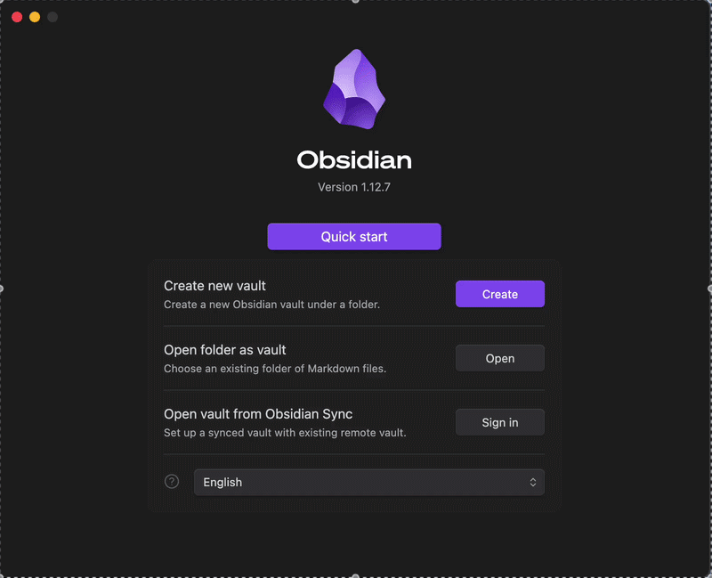
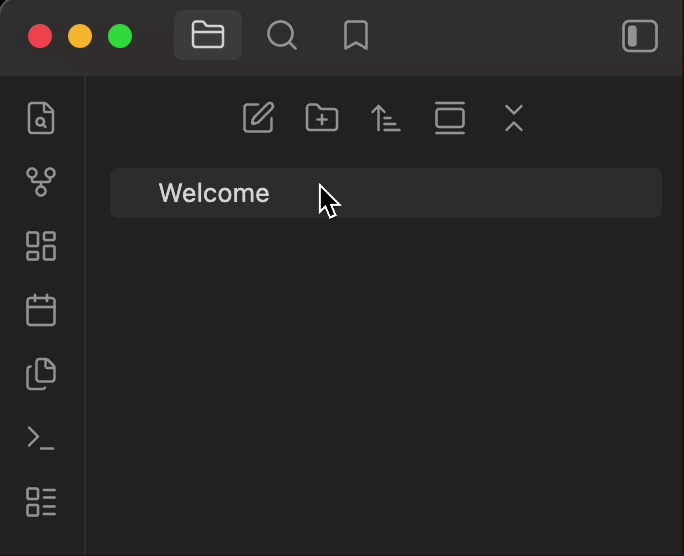
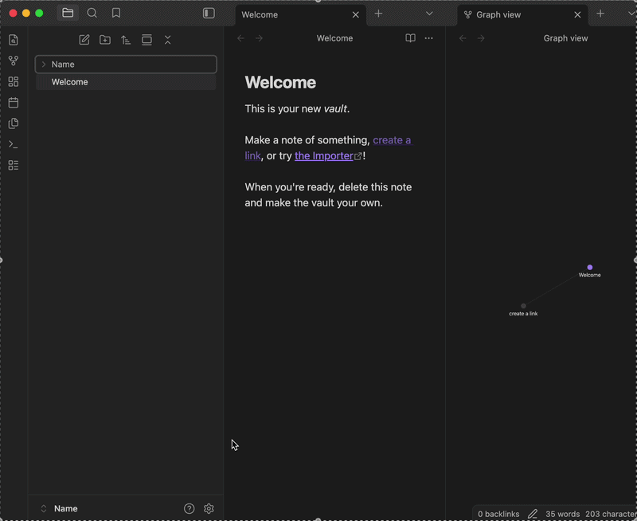
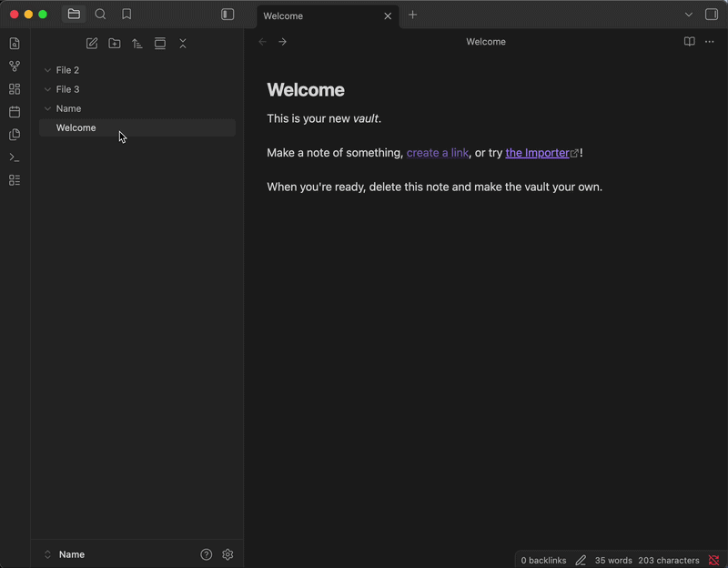
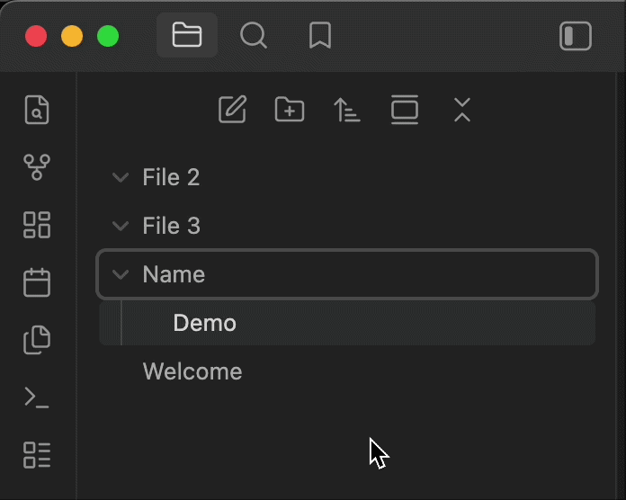
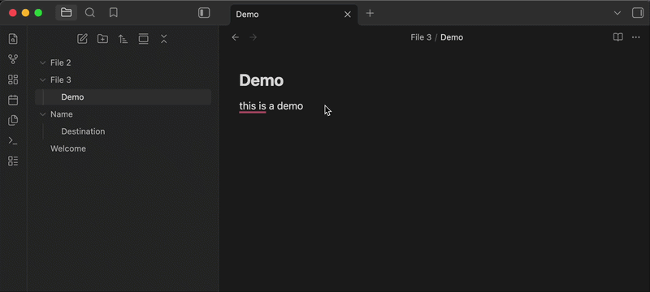
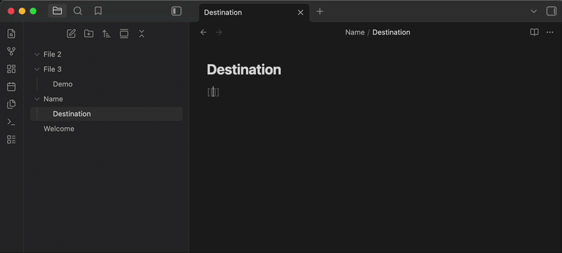
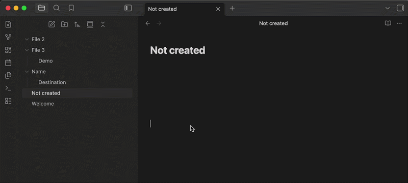
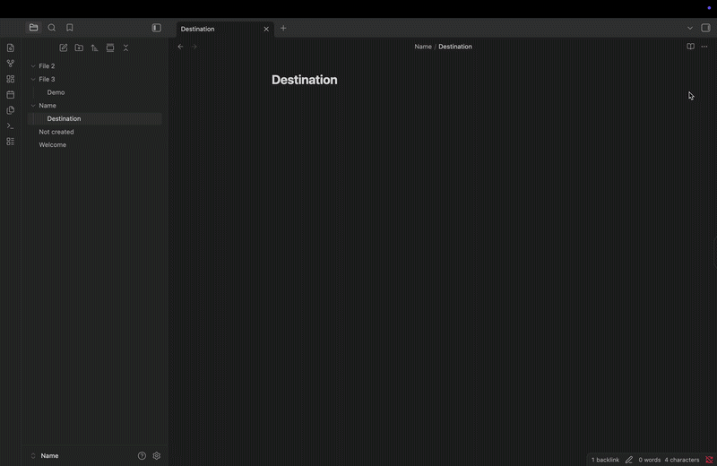

# Task 1: How to set up Obsidian and link notes

One of the main features that Obsidian provides that most other app or websites don't provide is the ability to link between different files and notes. This guide will show you how to set up Obsidian and link between different files.

## Making a vault

The first thing you see right after you install Obsidian is the home page, and the first step is to create a vault.

1. **Click** on the *Create* button right next to create a new vault.
2. **Create** a name for your vault and **find** a location on your computer for where you want to store it.
3. **Click** on *Create*.

## Creating folders

Now that you have created a vault, you should create several folders to store your notes.

1. **Click** on the folder icon with a plus sign in the middle, on the left of your screen
2. **Click** on it and give the folder a name of your choice.
3. **Repeat** it three times.

## Turning on Live Preview

Obsidian's Live Preview feature will allow you to see formatted text as you type it.

1. **Click** on the cog icon on the bottom left of your screen right next to the vaults name.
2. **Click** on *Editor* and make sure default editing mode is on *Live Preview*.

## Writing your first note

1. **Right click** on any one of your folders and click *New note*.
2. **Give** it a title of your choice.
3. **Write** anything.

## Moving notes

1. **Drag** the note that you just created and move it to another folder.

## Linking notes

1. **Open** a note and **type** two opening square brackets [[. Obsidian will show a list of existing notes that you can link to.
2. In the square brackets, **type** in the name of the notes you created in the previous step and press enter.

???+ note "Note"

    Now when you click on the link, it will open the note that you selected.

## Creating a new note from a link

In Obsidian you don't need to create a new note to link to it, you can create a link to the desired name and it will be automatically created.

1. Inside a existing note, **type** [[desired name]] and press enter. Obsidian will then instantly create a new note.

!!! warning "Warning"

    Make sure the name you put does not already exist.

## Adding a tag to a note  

Another great feature in Obsidian is the search function. By grouping notes up with tags, you can search the tag and all the notes that include that tag will show up. This is a great alternative if you don't want to link between the notes.

1. At the bottom or top of the note **add** a # followed by any relevant word of your choice, for example: #work

## Using back links

Imagine you have been using Obsidian for quite a while now, and have forgotten which notes links to what. With back links you can rediscover connections you might have forgotten about.

1. **Open** any note and look at the top right, **click** on the 3 dot icon.
2. **Select** Back links in document** from the menu.

???+ note "Note"

    If there are any back links, it should show a list of other notes that are linked to the one you're reading.

## Conclusion

You should now know how to set up your obsidian and link notes, and other beginning a tag to the note and a bunch of advance stuff.
