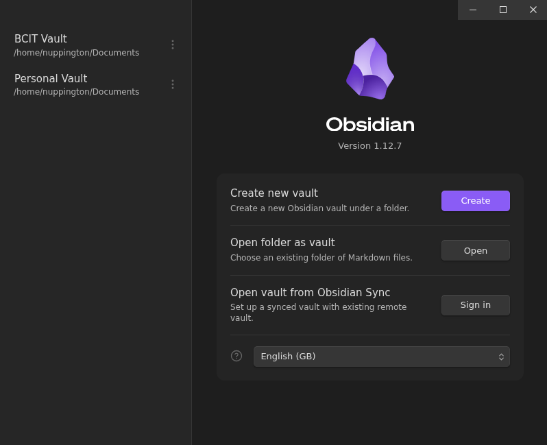
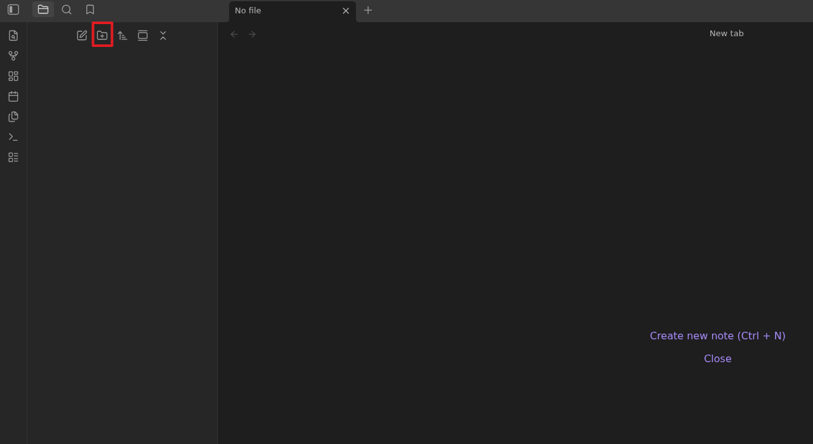
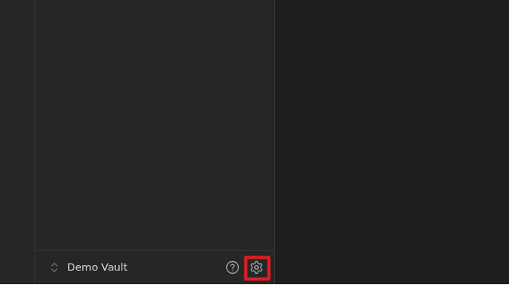
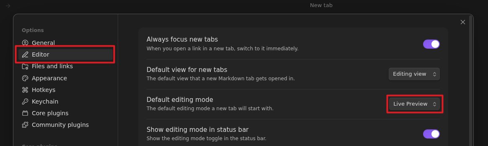
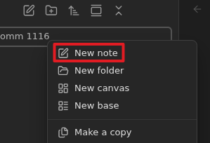
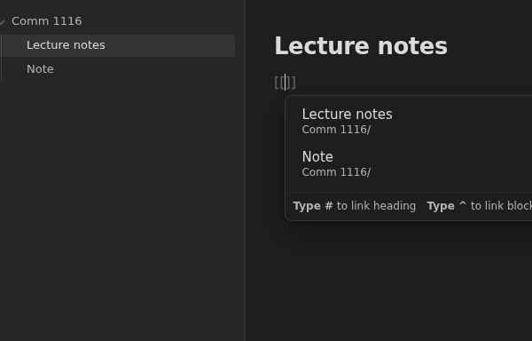

# Task 1: How to set up Obsidian and link notes

One of the main features that Obsidian provide that most other app/websites don't provide is the ability to link between different files and notes. This guide will show you how to set up Obsidian and link between different files.

## Making a vault

The first thing you see right after you install Obsidian is the home page, and the first step is to create a vault.

1. Click on the purple *Create* button to create a new vault.
2. Name your vault and set its location on your computer.

## Creating folders

Now that you have created a vault, you should create several folders to store your notes.

1. Click the folder icon with a plus sign on the top left of the screen and give the folder a name of your choice.
2. Repeat to create more folders for organization.

## Turning on Live Preview

Obsidian's Live Preview feature will allow you to see formatted text as you type it.

1. Click on the settings icon on the bottom left of your screen next to the vault name.
2. Click on *Editor* and make sure default editing mode is on *Live Preview*.

## Writing your first note

1. Right click any one of your folders and click *New note*.
2. Give it a title of your choice.
2. Write anything.

## Moving notes

1. Drag the note that you just created and move it to another folder.

## Linking notes

1. Open a note and type two opening square brackets ([[). Obsidian will show a list of existing notes that you can link to.
2. In the square brackets, type in the name of a note you created in the previous step and press enter.

???+ note "Note"

    Now when you click on the link, it will open the note that you selected.

## Creating a new note from a link

In Obsidian you don't need to create a new note to link to it, you can create a link to the desired name and it will be automatically created.

1. Inside an existing note, type [[desired name]] and press enter. Obsidian will create a new note.

## Adding a tag to a note  

Another great feature in Obsidian is the search function. By grouping notes up with tags, you can search the tag and all the notes that include that tag will show up. This is a great alternative if you don't want to link between the notes.

1. At the bottom or top of the note add a # following with a relevant word of your choice, for example: #work

## Using backlinks

Imagine you have been using Obsidian for quite a while now, and have forgotten which notes links to what. With backlinks you can rediscover connections you might have forgotten about.

1. Open any note and look at the top right, click on the 3 dot icon and click on the option called **Backlinks in document**.

???+ note "Note"

    If there are any backlinks, it should show a list of other notes that are linked to the one you're reading.
