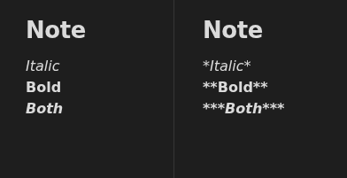
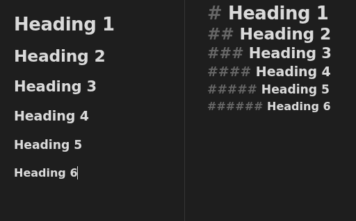
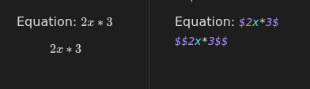
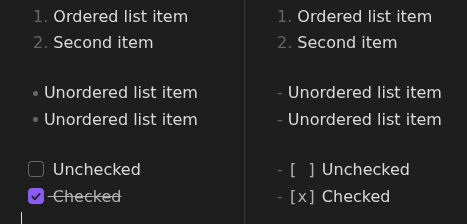
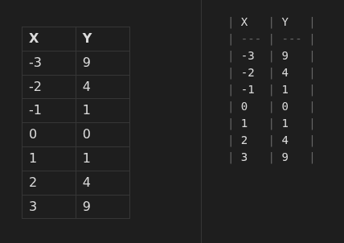
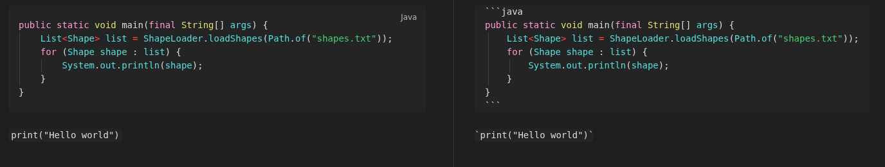

# Task 2: How to format notes in Obsidian

Obsidian notes are stored as Markdown files, which have a specific way of formatting text. This guide will show you all the ways to format your text.

## Bolding and italicizing

1. **Surround** your text in 1, 2, or 3 asterisks to italicize, bold, or both. Alternatively, select your text and press Control + B to bold and Control + I to italicize.

## Creating headings

Obsidian allows you to create headings using hashtags.

1. **Type** the hashtag symbol (\#) and press space, use more hashtags for a smaller heading.
2. **Type** your heading.

## Writing equations

Obsidian uses MathJax to interpret LaTeX equations, which allows for writing complex math equations. 

1. **Surround** an equation in dollar sign symbols (\$) to create a math equation, or use two dollar sign symbols instead to make it render on a new line.
2. **Write** any formula (complex formulas will need to use advanced statements, refer to [MathJax Cheat Sheet for Mathematical Notation](https://jojozhuang.github.io/tutorial/mathjax-cheat-sheet-for-mathematical-notation/).)

## Creating lists

Obsidian allows you to write lists in markdown.

1. **Type** 1. or - and press space.
2. **Write** something and press enter to create the next list item.

You can even make checklists by typing - [ ] and pressing space.

## Creating tables

1. **Right click** inside a note.
2. **Click** on *Insert -> Table*.

## Writing code blocks

1. **Write** three backticks (`) and optionally the programming language for highlighting, then press enter. 
2. **Write** your code and end the block by putting another three backticks on a new line. 

Alternatively, you can write inline code blocks by surrounding text in single backticks.

## Conclusion

You should now know how to format your text in Obsidian. You can now write advanced notes with headings, math equations, tables, and more.
