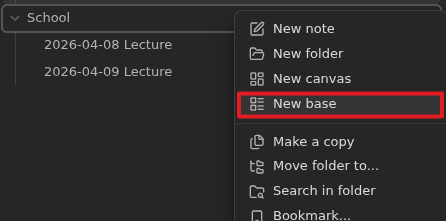
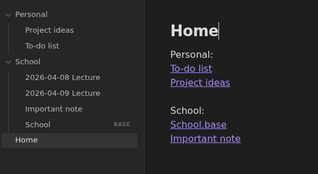

# Task 3: How to create and organize a knowledge base in Obsidian

As you add more notes to your vault, organizing and structuring them becomes more important. This guide will show you how to organize your notes efficiently.

## Creating a consistent naming system

1. Decide on a format for your notes (DD-MM-YYYY, Class - Topic, etc).
2. **Rename** existing notes to match the format.

## Using folders

Folders can be used to seperate notes into catergories and declutter your vault.

1. **Create** folders to catergorize your notes (School, Personal / Math, Science, Physics).
2. **Move** notes into their respective folders.

## Creating a base file

A base is an organized database view of all the notes in a vault with an advanced filtering system.

1. **Right click** on a folder.
2. **Select** *New base* and give it a name, usually the name of the folder.
3. **Click** on the *Filter* button and filter to the folder as shown.

You can add more filters, like `file full name does not end with .base` to filter out base files. You can also change the view from Table to view your notes as cards or in a list.

## Creating a home / index note

A home or index note is a collection of links to important notes inside a vault / folder.

1. **Create** a new note and give it a fitting name (Index, Home).
2. **Create** links to important notes and bases inside your home note.

You can also create index notes inside folders, then link to those from the main note.

## Using tags

Tags can be used as a second form of catergorization. If you use your folders to organize school notes by subject, you could use tasks to organize those notes by lab or lecture, or vice versa.

1. **Add** tags to notes to further catergorize them (#assignment, #lecture).
2. **Click** the tag or use the search bar to search notes by tag.
