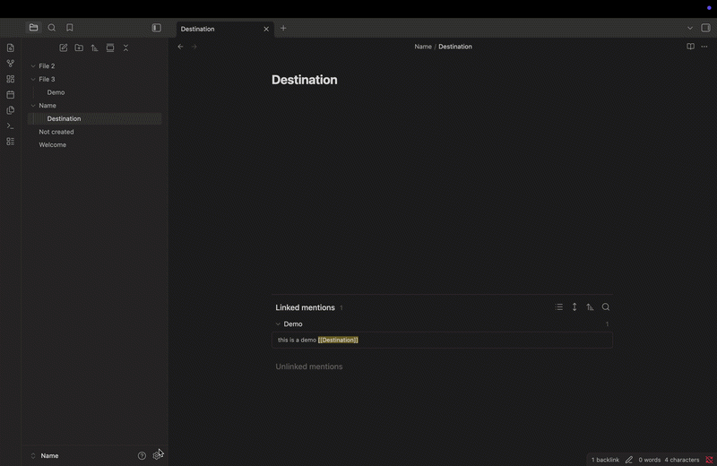
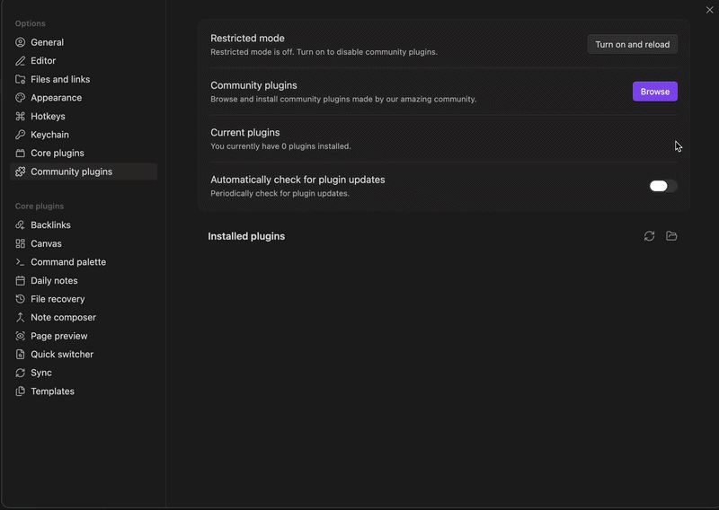
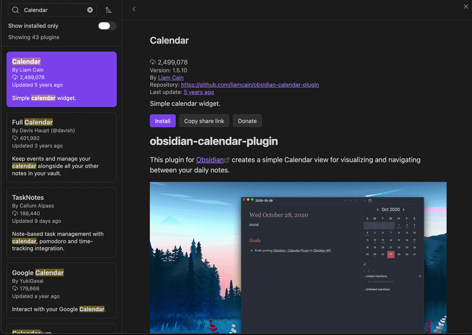
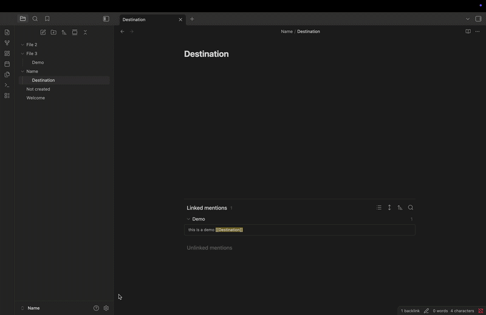
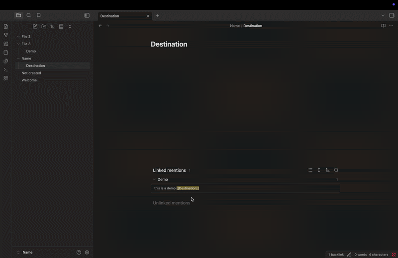
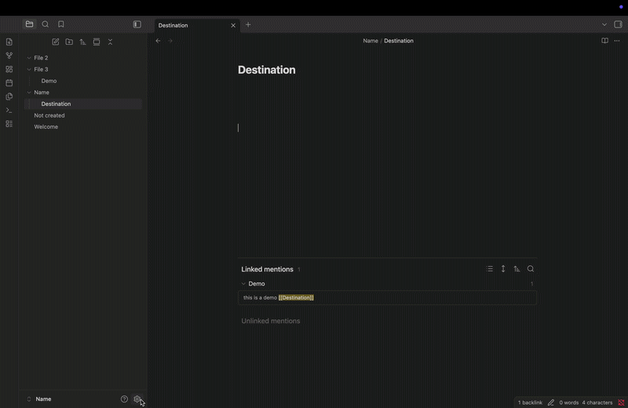
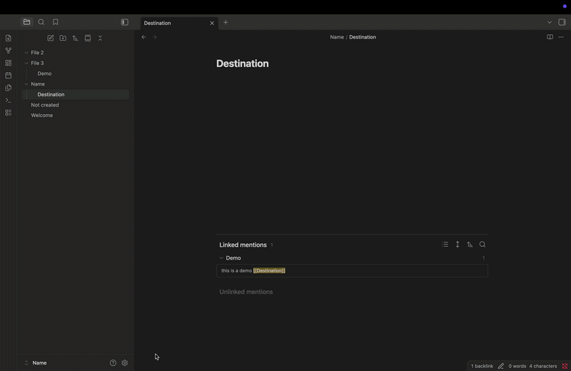
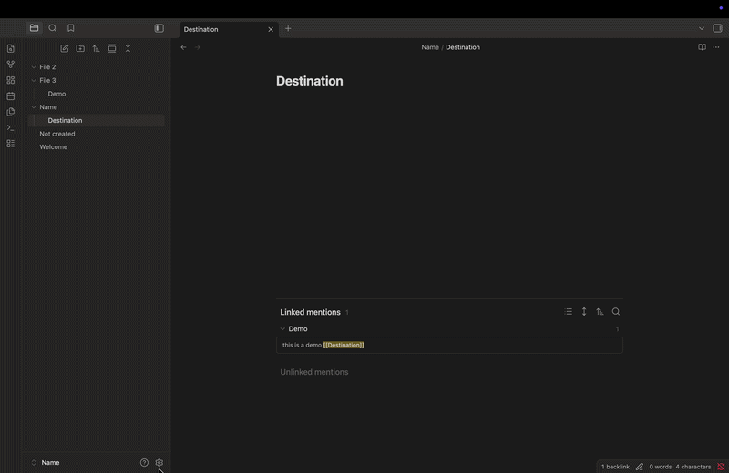
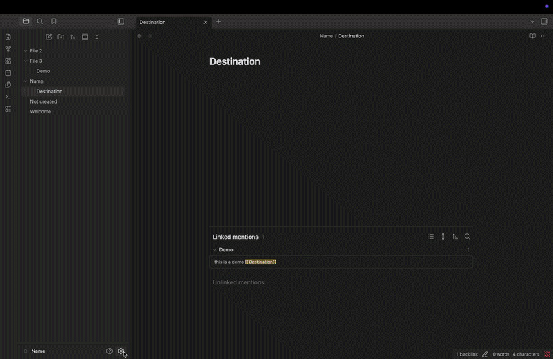

# Task 1: How to Use and Add Plugins in Obsidian

One of the most powerful features in obsidian is **plugins**. Plugins let you add extra features to your workspace that you won't normally have, think about it like an customization options that you change to fit exactly to your preference.

## Enabling Community Plugins

1. **Go** to Setting by clicking on the gears icon on the bottom left of your screen.
2. **Click** on Community Plugins.
3. **Click** Turn on community plugins.

???+ note "Note"

    Obsidian automatically has this block off for new users.

## Searching for a Plugin

1. **Click** on the **Browse** button while in the community plugin page.
2. **Search/find** the plugin you want to install.
3. **Click** on the plugin and read the description.

## Installing the Plugin

Once you found the plugin you want to download.

1. **Click** install on the Plugin you want to install.
2. **Click** Enable to activate it.

!!! warning "Warning"

    Make sure you Enable it otherwise the Plugin won't run.

## Configure the Plugin

1. **Go** to Setting.
2. **Find** the Plugin name and adjust the setting to your preferences.

## Using the Plugin

Once you have all that set up you can finally use your Plugin just make sure to return to notes first.

1. **Press** Cmd + P for (Mac) or Ctrl + P for (Windows) to open Command Palette.
2. **Type** the plugin Name for its commands.

## Keep Plugins Updated

1. **Go** to Setting.
2. **Click** on Community Plugin.
3. **Click** on the Check for updates button and update all.

???+ note "Note"

    If it says no plugin updates found you are up to date.

## Disable or Remove a plugin

1. **Go** to Setting.
2. **Click** on Community Plugin.
3. **Click**k on the show installed only.
4. **Click** on the plugin you want to change.
5. **Click** on disable or uninstall to remove it completely.

## Use Hotkeys with your plugin

1. **Go** to Setting.
2. **Click** on Hotkeys.
3. **Type** in the plugin name to see all the commands.
4. **Click** on the + button next to the command and press the key you want to bound it with

???+ note "Note"

    Now when you press the key you bound it with it will automatically run that command.

!!! warning "Warning"

    You have to include a ⌘ or ⌥ or ⌃ before a key otherwise it won't work for (mac) and ctrl, alt, windows for (windows)

## Support a plugin

1. **Go** to Setting.
2. **Click** on Community Plugin.
3. **Click** on Browse and find the plugin you want to rate/review.
4. **Click** on the github repository link.
5. **Click** on the star to show support.

